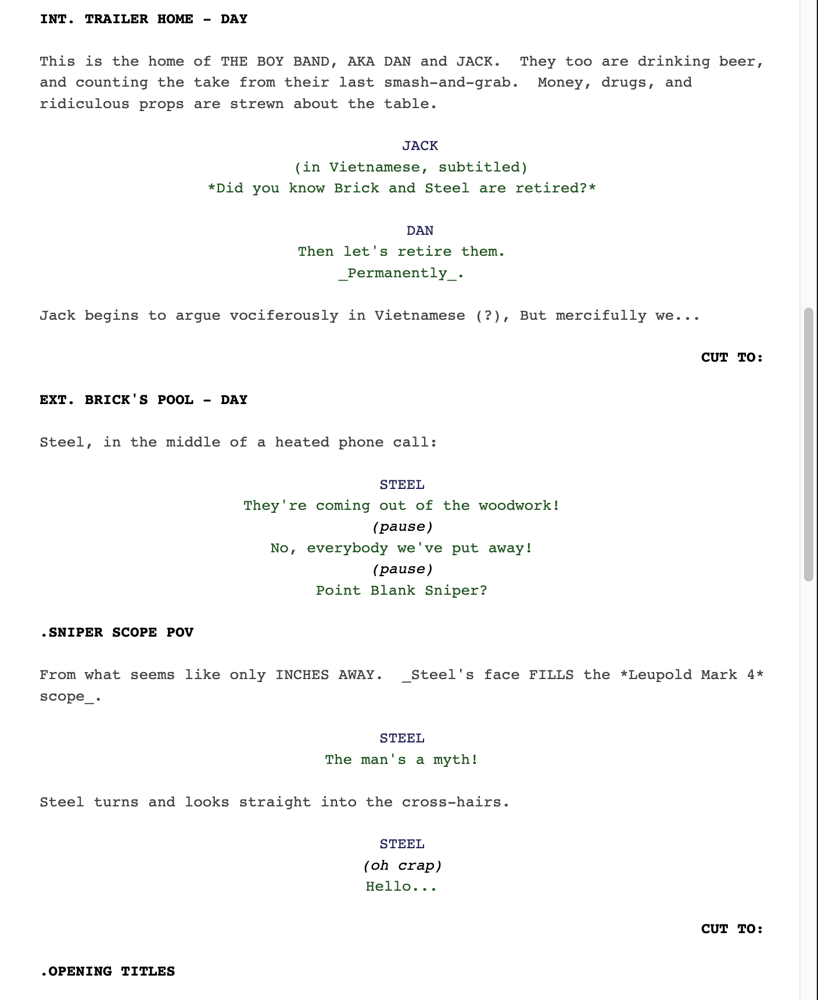

# codemirror-lang-fountain

**Naive CM5 StreamParser implementation for the [Fountain screenplay syntax](https://fountain.io/).** (currently abandoned)

Try it out in this [live demo](<https://chuangcaleb.github.io/codemirror-lang-fountain/>)!



## Usage

Use the [CodeMirror Language Package Example](https://codemirror.net/examples/lang-package/) tutorial as your main reference. The [demo](./demo) directory can be used for your reference as an example implementation.

First, run `pnpm prepare` at root directory according to [package.json](./package.json)'s `prepare` script. This runs `cm-buildhelper src/fountain.ts` to transpile the Typecsript source code into a `/dist` directory.

Then, from the [demo](./demo) directory, run `pnpm rollup` according to `/demo`'s [package.json](./demo/package.json)'s `rollup` script to use rollup to bundle [source code](./demo/editor.mjs), which is like below:

```js
import { syntaxHighlighting } from "@codemirror/language";
import { EditorView, minimalSetup } from "codemirror";
import { fountain, fountainHighlight } from "codemirror-lang-fountain";

let editor = new EditorView({
  extensions: [minimalSetup, fountain(), syntaxHighlighting(fountainHighlight)],
  parent: document.body,
  lineWrapping: true,
});
```

Finally, import your bundled script in your target html like so!

```html
<!DOCTYPE html>
<meta charset="utf8" />
<head>
  <link rel="stylesheet" href="demo/styles.css" />
</head>
<h1>CodeMirror!</h1>
<script src="demo/editor.bundle.js"></script>
```

## Features

It currently attaches formatting tags for the following [Fountain syntax](https://fountain.io/syntax) tokens:

- Scene Headings
- Character
- Dialogue
- Parenthetical
- Centered Text
- Transition
- Synopsis
- Page Breaks

There's some rudimentary syntax highlighting rules too.

## Disclaimer

My original purpose was to have syntax highlighting for Fountain in [Obsidian](https://obsidian.md/)'s editor. That is why I didn't yet handle markdown formatting, since the purpose was to extend CodeMirror's already-established markdown extension.

Oh, and centered text is kinda broken rn.

My original intent has now shifted strategy to use CodeMirror's Decoration API instead, as a native Obsidian plugin. You may find this project at  [chuangcaleb/obsidian-live-fountain](https://github.com/chuangcaleb/obsidian-live-fountain).

I have therefore abandoned this project and archived it. Feel free to use/modify however you wish!
